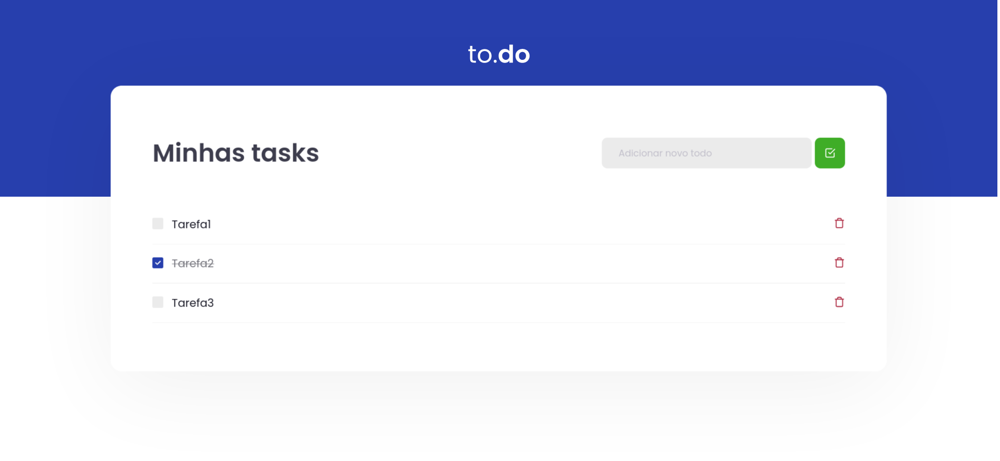

<h1 align="center">

</h1>

<h3>Desafio 1 - Conceitos do ReactJS</h3>

  

  

  

<h3>Tecnologias</h3>

Esse projeto foi desenvolvido com as seguintes tecnologias: 

- [ReactJS](https://reactjs.org)
- [TypeScript](https://www.typescriptlang.org/)

<h3>Projeto</h3>

Objetivo do desafio é desenvolver, partindo de um <a href="https://github.com/rocketseat-education/ignite-template-reactjs-conceitos-do-react" target="_blank" rel="noopener noreferrer"> template</a>, funcionalidades para uma aplicação de lista de atividades, <i>to-do list</i>, para treinar sobre manipulação de estado no ReactJS.

Funcionalidades que foram desenvolvidas:

    - handleCreateNewTask: Deve ser possível adicionar uma nova task no estado de tasks, com os campos id que deve ser gerado de forma aleatória, title que deve ser um texto e isComplete que deve iniciar como false.
    - handleToggleTaskCompletion: Deve alterar o status de isComplete para uma task com um ID específico que é recebido por parâmetro.
    - handleRemoveTask: Deve receber um ID por parâmetro e remover a task que contém esse ID do estado.

<h3>Instalação e Execução do Projeto</h3>

    - Clone o repositório
    git clone https://github.com/silvacf/desafio-conceitos-do-react.git
    
    - Navegue até o diretório principal
    cd desafio-conceitos-do-react
   
    - Instale as dependências do projeto
    yarn
    
    - Execute o projeto
    yarn dev
   

Agora você pode acessar o projeto em [`localhost:8080`](http://localhost:8080) no seu navegador.

<h3>Licença</h3>
Esse projeto foi feito com licença MIT.

---

